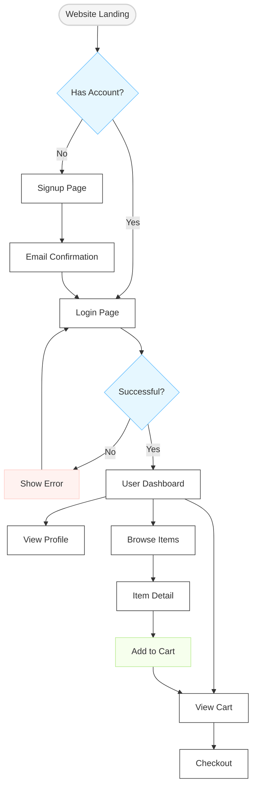
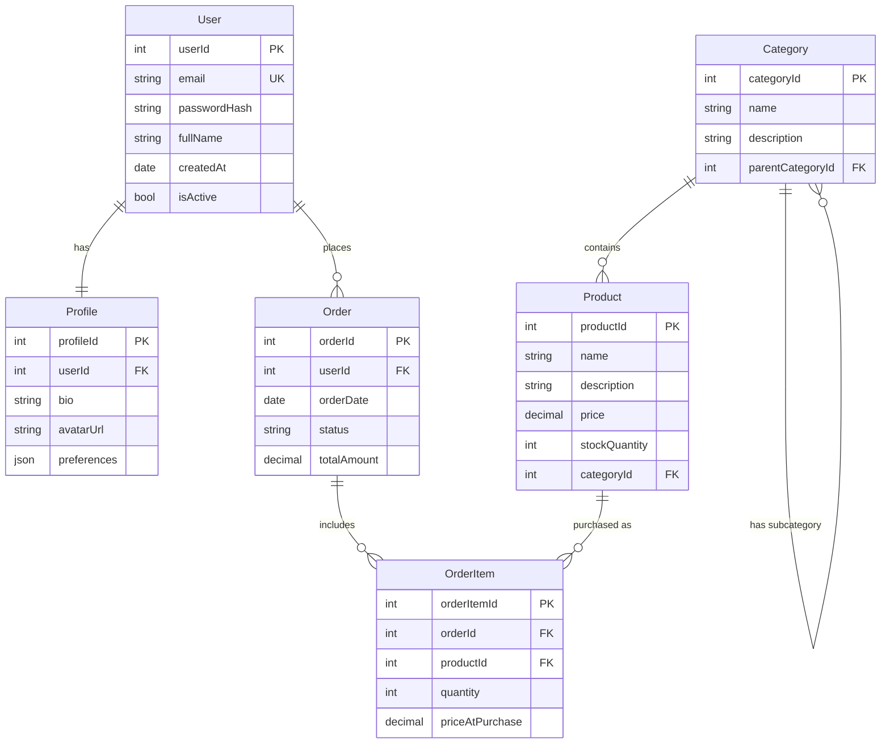

# Mermaid.js Best Practices and Guidelines

## Table of Contents
1. [Introduction](#introduction)
2. [General Best Practices](#general-best-practices)
3. [Diagram Type-Specific Guidelines](#diagram-type-specific-guidelines)
4. [User Flow Diagrams](#user-flow-diagrams)
5. [Data Schema Diagrams](#data-schema-diagrams)
6. [Accessibility Considerations](#accessibility-considerations)
7. [Integration and Deployment](#integration-and-deployment)
8. [Troubleshooting](#troubleshooting)

## Introduction

[Mermaid.js](https://mermaid.js.org/) is a JavaScript-based diagramming and charting tool that renders Markdown-inspired text definitions to create diagrams dynamically. This document outlines the best practices and guidelines for creating clear, effective, and maintainable Mermaid diagrams.

### Key Benefits of Mermaid

- **Text-based**: Diagrams are defined using text, making them version-control friendly
- **Markdown integration**: Works seamlessly in many Markdown environments
- **Wide diagram support**: Flowcharts, sequence diagrams, class diagrams, ER diagrams, and more
- **Live editing**: Tools like the [Mermaid Live Editor](https://mermaid.live/) enable real-time preview
- **Customizable**: Themes and styling options for visual consistency

## General Best Practices

### Diagram Structure

1. **Start with a declaration**: Always begin with the diagram type declaration:
   ```
   graph TD
   ```
   or
   ```
   sequenceDiagram
   ```

2. **Use consistent direction**:
   - `TB` (top to bottom)
   - `TD` (top-down, same as TB)
   - `BT` (bottom to top)
   - `RL` (right to left)
   - `LR` (left to right)

3. **Limit diagram size**: Keep diagrams focused on one concept or process. Create multiple diagrams for complex systems rather than one large diagram.

4. **Include a title**:
   ```
   ---
   title: Authentication Flow
   ---
   ```

### Naming and Identifiers

1. **Use clear, consistent node IDs**:
   - Use camelCase or snake_case consistently
   - Add descriptive suffixes for node types (e.g., `userInput_form`, `data_validation`)

2. **Choose meaningful labels**: Node labels should be concise but descriptive.

3. **Avoid special characters** in node IDs.

4. **Comment complex sections**:
   ```
   %% Authentication section
   ```

### Styling and Readability

1. **Apply consistent styling**:
   ```
   classDef success fill:#58c058,stroke:#13540a,stroke-width:1px;
   classDef error fill:#e83b3b,stroke:#7e0000,stroke-width:1px;
   ```

2. **Use color purposefully**:
   - Limit to 4-5 distinct colors
   - Use colors to represent status, type, or importance
   - Ensure sufficient contrast

3. **Group related nodes** using subgraphs:
   ```
   subgraph Backend
     api[API Gateway]
     auth[Authentication]
     db[(Database)]
   end
   ```

4. **Maintain visual hierarchy**:
   - Most important elements should stand out
   - Use consistent sizes and shapes for similar components

### Version Control and Maintenance

1. **Include metadata comments**:
   ```
   %% Author: Adam Jackson
   %% Last Updated: 2025-03-05
   %% Version: 1.2
   ```

2. **Structure complex diagrams** in separate files and combine when needed.

3. **Document assumptions and scope** at the beginning of each diagram.

## Diagram Type-Specific Guidelines

### Flowcharts

1. **Start with a clear entry point**.

2. **Use appropriate node shapes**:
   - Rectangles `[]` for processes
   - Rounded rectangles `()` for start/end
   - Diamonds `{}` for decisions
   - Cylinders `[()]` for databases

3. **Limit decision branches** to 2-4 options.

4. **Label all connecting lines** for clarity.

### Sequence Diagrams

1. **List all participants** at the beginning:
   ```
   participant User
   participant API
   participant Database
   ```

2. **Use actors for human interactions**:
   ```
   actor User
   ```

3. **Group messages with alt/opt/loop** when appropriate:
   ```
   alt successful case
     User->>API: Submit form
   else error case
     API-->>User: Show error
   end
   ```

4. **Add notes for clarifications**:
   ```
   Note over User,API: Authentication process
   ```

### Entity Relationship Diagrams

1. **Start with entities before relationships**.

2. **Use clear cardinality notation**:
   ```
   User ||--o{ Order : places
   ```

3. **Include key attributes** for each entity.

4. **Group related entities** visually when possible.

### Class Diagrams

1. **Organize by inheritance hierarchy**.

2. **List the most important members** only.

3. **Use appropriate visibility symbols**:
   - `+` for public
   - `-` for private
   - `#` for protected

4. **Show relationships with proper notation**:
   - Extensions/inheritance: `<|--`
   - Composition: `*--`
   - Aggregation: `o--`

### Gantt Charts

1. **Define clear sections**.

2. **Use consistent time units**.

3. **Highlight critical paths**.

4. **Include dependencies** between tasks.

## User Flow Diagrams

User flows are crucial for visualizing how users interact with your system. Here are specialized best practices for creating effective user flow diagrams with Mermaid.

### Structure and Organization

1. **Use flowchart (graph) type** for user flows:
   ```
   graph TD
   ```

2. **Start with user entry points**:
   ```
   begin([Landing Page])
   ```

3. **Group screens/views in subgraphs**:
   ```
   subgraph Authentication
     login[Login Page]
     register[Registration Page]
     reset[Password Reset]
   end
   ```

4. **Maintain a consistent flow direction** (typically top-to-bottom or left-to-right).

### Node and Connection Conventions

1. **Use specific node shapes**:
   - Rounded rectangles `()` for entry/exit points
   - Rectangles `[]` for screens/pages
   - Diamonds `{}` for user decisions
   - Circles `(())` for user actions

2. **Color-code by user state**:
   ```
   classDef unauthenticated fill:#f9d5e5;
   classDef authenticated fill:#e3eaa7;
   classDef admin fill:#b5ead7;
   ```

3. **Label edges with user actions**:
   ```
   login --> dashboard[Dashboard] : "Successful login"
   ```

4. **Represent conditional paths** clearly:
   ```
   loginAttempt{Authentication} -->|Success| dashboard
   loginAttempt -->|Failure| loginError[Error Message]
   ```

### Practical Example



### Tips for User Flow Diagrams

1. **Focus on the user's perspective**, not the system architecture.

2. **Include error states and recovery paths** for comprehensive flows.

3. **Annotate with expected user emotions** or pain points where relevant.

4. **Differentiate between required and optional steps**.

5. **Indicate estimated time or complexity** for critical paths.

6. **Separate flows for different user roles** (e.g., guest, registered user, admin).

7. **Align with actual UI components** using consistent naming.

## Data Schema Diagrams

Data schema diagrams help visualize the structure and relationships within your data model. Mermaid's Entity Relationship Diagrams (ERD) are perfect for this purpose.

### Structure and Organization

1. **Use the erDiagram type**:
   ```
   erDiagram
   ```

2. **Start with core entities** and expand outward.

3. **Group related entities** conceptually.

4. **Maintain a clear hierarchy** if applicable.

### Entity and Relationship Conventions

1. **Use PascalCase for entity names** and camelCase for attributes:
   ```
   User {
     int userId PK
     string email
     string passwordHash
   }
   ```

2. **Include data types** for all attributes.

3. **Mark key fields** with proper notation:
   - `PK` for Primary Key
   - `FK` for Foreign Key
   - `UK` for Unique Key

4. **Use standard relationship notations**:
   - One-to-one: `||--||`
   - One-to-many: `||--o{`
   - Many-to-many: `}o--o{`

5. **Label relationships** with verbs in both directions:
   ```
   User ||--o{ Order : "places"
   Order }o--|| User : "placed by"
   ```

### Practical Example



### Tips for Data Schema Diagrams

1. **Include only essential attributes** to avoid cluttering.

2. **Consider creating separate diagrams** for different subsystems.

3. **Use consistent naming conventions** across all entities and attributes.

4. **Indicate indexes** and performance-critical fields.

5. **Include data validation constraints** where important.

6. **Document nullable vs. required fields** with notation like `*` for required.

7. **Show database-specific features** with comments when relevant.

8. **Align with actual database implementation** terminology.

## Accessibility Considerations

1. **Add alt text** when embedding diagrams in documentation.

2. **Choose color schemes with sufficient contrast**.

3. **Avoid color as the only differentiator**.

4. **Provide text descriptions** alongside complex diagrams.

5. **Test with screen readers** if your diagrams will be widely distributed.

## Integration and Deployment

### Markdown Integration

1. **GitHub, GitLab, and Bitbucket** support Mermaid natively:
   ````
   ```mermaid
   graph TD
     A[Start] --> B[End]
   ```
   ````

2. **Documentation systems** like Docusaurus, VuePress, and MkDocs can integrate Mermaid with plugins.

### Web Integration

1. **Use the Mermaid CDN**:
   ```html
   <script src="https://cdn.jsdelivr.net/npm/mermaid/dist/mermaid.min.js"></script>
   <script>mermaid.initialize({startOnLoad:true});</script>
   ```

2. **Initialize with configuration**:
   ```javascript
   mermaid.initialize({
     theme: 'forest',
     logLevel: 'error',
     securityLevel: 'strict',
     startOnLoad: true
   });
   ```

3. **Dynamically render** with the API:
   ```javascript
   mermaid.render('graphDiv', 'graph TD\nA-->B', (svg) => {
     document.querySelector('#output').innerHTML = svg;
   });
   ```

## Troubleshooting

### Common Issues and Solutions

1. **Syntax errors**:
   - Use the [Mermaid Live Editor](https://mermaid.live/) to validate your syntax
   - Check for missing closing brackets, quotes, or semicolons

2. **Rendering problems**:
   - Ensure proper initialization
   - Verify that your Mermaid version supports the diagram type you're using

3. **Complex diagram performance**:
   - Break into smaller diagrams
   - Reduce the number of nodes and connections
   - Consider using the `maxTextSize` configuration option

4. **Integration issues**:
   - Check for conflicts with other JavaScript libraries
   - Verify that the content is properly escaped in your environment

### Debugging Techniques

1. **Enable debug logging**:
   ```javascript
   mermaid.initialize({
     logLevel: 'debug'
   });
   ```

2. **Use browser developer tools** to inspect for JavaScript errors.

3. **Isolate the diagram** in a minimal test case.

4. **Incrementally build complex diagrams**, testing at each step.

---

This guide aims to help you create effective, maintainable Mermaid diagrams. Remember that the most successful diagrams prioritize clarity and purpose over visual complexity. As your diagrams evolve, continue to refine them based on feedback and changing requirements.

*Last updated: March 5, 2025*
